# Hi there 👋

I'm Jack Plowman, a software engineer specialising in backend development and DevOps. My core tech stack is Python, Terraform, and AWS.

Consider taking a look at my [tech stack](https://jackplowman.github.io/tech-radar/) if you're interested in learning more about my skills and technologies.

